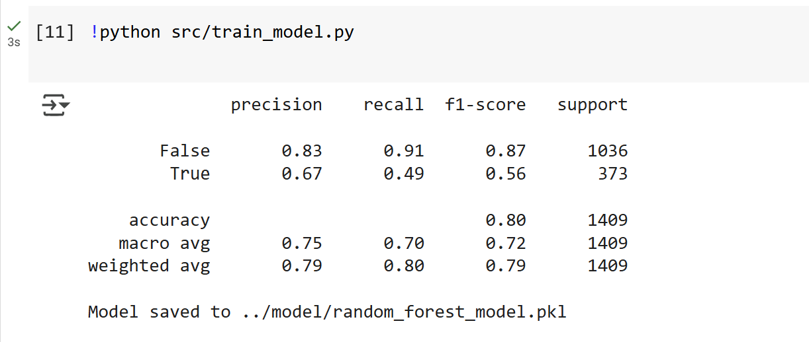
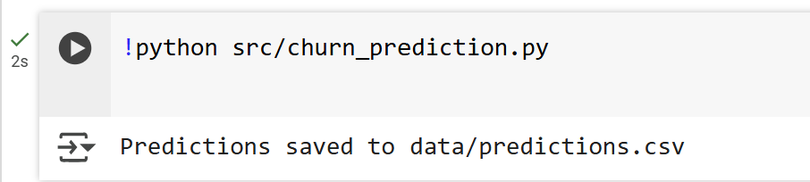

# Customer Churn Prediction and Visualization

## Overview

This project focuses on predicting customer churn using machine learning and visualizing key insights to aid business decision-making. It demonstrates data preprocessing, model training, and prediction while emphasizing reproducibility and scalability.

### Key Features:

- **Data Cleaning:** Cleans and preprocesses the dataset to handle missing values and encode categorical data.
- **Model Training:** Trains a machine learning model (Random Forest) to predict customer churn.
- **Prediction:** Provides a framework for making churn predictions on new data.
- **Visualization:** Offers insights into customer churn via tools like Power BI.

## Steps Followed:

### Step 1: Data Cleaning

- Cleaned the raw data to handle missing values and ensure consistency.
- Saved the cleaned dataset as `data/cleaned_data.csv`.

### Step 2: Model Training

- Used a Random Forest classifier to train the model.
- Achieved an accuracy of 80% with precision, recall, and F1-scores as follows:

#### **Classification Report:**

| Class        | Precision | Recall   | F1-Score | Support  |
| ------------ | --------- | -------- | -------- | -------- |
| False        | 0.83      | 0.91     | 0.87     | 1036     |
| True         | 0.67      | 0.49     | 0.56     | 373      |
| **Accuracy** | **0.80**  | **0.80** | **0.80** | **1409** |
| Macro Avg    | 0.75      | 0.70     | 0.72     | 1409     |
| Weighted Avg | 0.79      | 0.80     | 0.79     | 1409     |

- Model saved to `model/random_forest_model.pkl`.

#### **Screenshot:**



### Step 3: Churn Prediction

- Ran predictions on the test dataset.
- Saved the predictions to `data/predictions.csv`.

#### **Screenshot:**



### Step 4: Documentation

- Documented the process in this README file.
- Added screenshots of successful execution and key outputs.

## Folder Structure

```plaintext
customer-churn-prediction/
|
├── data/
│   ├── raw_data.csv         # Original dataset
│   ├── cleaned_data.csv     # Processed dataset (generated by clean_data.py)
│   ├── predictions.csv      # Predictions (generated by churn_prediction.py)
│
├── model/
│   ├── random_forest_model.pkl  # Trained model file
│
├── src/
│   ├── clean_data.py        # Script for data cleaning
│   ├── train_model.py       # Script for training the machine learning model
│   ├── churn_prediction.py  # Script for generating churn predictions
│
├── notebooks/               # (Optional) Jupyter Notebooks for EDA and exploration
│
├── requirements.txt         # Python dependencies
├── README.md                # Documentation (this file)
└── LICENSE                  # Project license (if applicable)
```

---

## Dataset
We use the **Telco Customer Churn** dataset from [Kaggle](https://www.kaggle.com/blastchar/telco-customer-churn), which includes customer information such as demographics, account details, and churn status.

- **File**: `data/customer_data.csv`
- **Target Variable**: `Churn` (Yes/No)

---

## Prerequisites
To run this project, ensure you have the following installed:

- Python 3.7 or higher
- pip (Python package manager)

Install required Python libraries:
```bash
pip install -r requirements.txt
```

---

## How to Run the Project
### 1. Clone the Repository
Clone this repository to your local machine or Google Colab:
```bash
git clone https://github.com/your-username/customer-churn-prediction.git
cd customer-churn-prediction
```

### 2. Data Cleaning
Run the `data_cleaning.py` script to preprocess the dataset:
```bash
python src/data_cleaning.py
```
**Output**: `data/cleaned_data.csv`

### 3. Model Training
Run the `train_model.py` script to train the Random Forest model:
```bash
python src/train_model.py
```
**Output**: `model/random_forest_model.pkl`

### 4. Make Predictions
Run the `churn_prediction.py` script to make predictions:
```bash
python src/churn_prediction.py
```
**Output**: `data/predictions.csv`

---

## Visualizations (Optional)
1. Open `data/predictions.csv` in Power BI.
2. Create dashboards to visualize:
   - Churn rates by demographic features.
   - Correlations between features and churn.
3. Save your `.pbix` Power BI file and upload it to the `visualizations/` folder (optional).

---

## References
- Dataset: [Telco Customer Churn](https://www.kaggle.com/blastchar/telco-customer-churn)
- Python Libraries: [Scikit-learn](https://scikit-learn.org/), [Pandas](https://pandas.pydata.org/)
- Visualization: [Power BI](https://powerbi.microsoft.com/)

---

## License
This project is licensed under the MIT License. See the `LICENSE` file for details.

---

## Contributing
Contributions are welcome! Feel free to fork the repository and submit a pull request.

---

## Contact
For questions or feedback, reach out via:
- LinkedIn: [Prabhani Gunasekera](https://www.linkedin.com/in/prabhanigunasekera)
- GitHub: [Prabhani Gunasekera](https://github.com/prabhanig)
